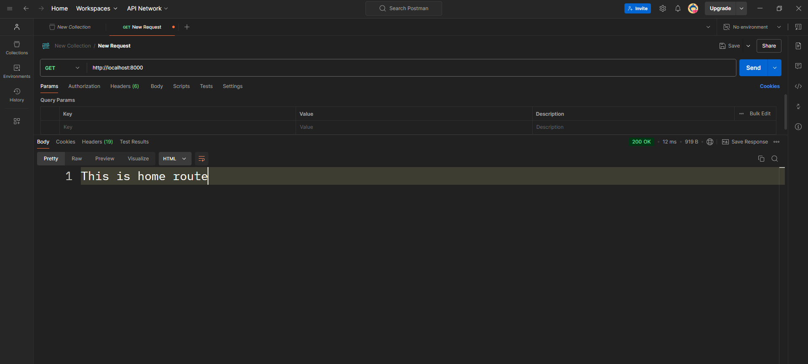

# Server Setup and Testing with Postman

Этот документ описывает настройку сервера на Express, проверку его работоспособности с использованием Postman, а также тестирование с помощью команды `curl.exe`.

## 1. Настройка сервера Express

В файле `index.ts` настроен сервер с использованием следующих зависимостей:
- **express** — для создания маршрутов и обработки HTTP-запросов.
- **dotenv** — для загрузки переменных окружения из файла `.env`.
- **helmet** — для защиты приложения путем установки безопасных HTTP-заголовков.
- **morgan** — для логирования всех HTTP-запросов.
- **body-parser** — для обработки тела запросов (JSON и URL-encoded).
- **cors** — для управления политикой кросс-доменных запросов.

### Пример кода сервера:
```typescript
import express from "express";
import dotenv from "dotenv";
import bodyParser from "body-parser";
import cors from 'cors';
import helmet from "helmet";
import morgan from "morgan";

dotenv.config();
const app = express();
app.use(express.json());
app.use(helmet());
app.use(helmet.crossOriginResourcePolicy({ policy: 'cross-origin' }));
app.use(morgan("common"));
app.use(bodyParser.json());
app.use(bodyParser.urlencoded({ extended: false }));
app.use(cors());

app.get('/', (req, res) => {
  res.send('This is home route');
});

const port = process.env.PORT || 3000;
app.listen(port, () => {
  console.log(`Server running on port ${port}`);
});
```
## 2. Тестирование сервера с использованием Postman
После настройки сервера был проведен тест с использованием Postman.  
### Шаги:
1. Запусти сервер командой:
   ```bash
   pnpm run dev
   ```
2. Открой Postman и отправь GET-запрос на http://localhost:8000.
3. Ожидаемый результат — сообщение "This is home route".

## Ожидаемый результат



## 3. Тестирование с помощью curl.exe
Для проверки работоспособности сервера можно использовать команду curl.exe в PowerShel
1. Команда для PowerShell:
   ```bash
   curl.exe localhost:8000
   ```
Эта команда отправляет GET-запрос на сервер, и ожидается, что сервер ответит текстом "This is home route".
   