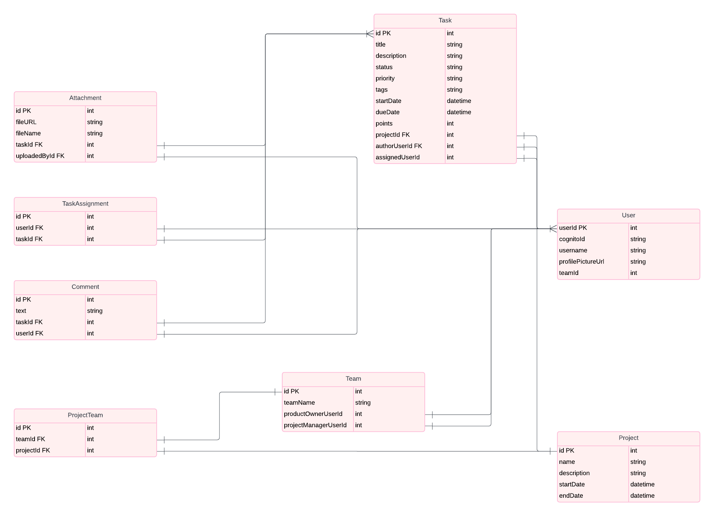

# Структура системы управления задачами

## Обзор

Этот документ описывает структуру системы управления задачами на основе UML-диаграммы классов. В нем представлены ключевые сущности, их атрибуты и взаимосвязи в системе, а также объясняется, зачем используются PK и FK, и как определяются типы данных для атрибутов.

---

## UML Диаграмма

---

## Основные понятия

### 1. **Primary Key (PK) — Первичный ключ**

**Первичный ключ** (Primary Key) — это уникальный идентификатор каждой записи в таблице. Он нужен для того, чтобы каждая запись была уникальной и имела свою собственную "визитную карточку" в базе данных.

- Например, для сущности **Task** (Задача) поле `id PK` является первичным ключом и гарантирует, что каждая задача в системе будет иметь уникальный идентификатор.
- **Тип данных** для первичного ключа — обычно это `int` (целое число), так как числовые значения легче индексировать, и они быстрее обрабатываются базой данных.

### 2. **Foreign Key (FK) — Внешний ключ**

**Внешний ключ** (Foreign Key) — это поле, которое ссылается на первичный ключ другой сущности. Это позволяет установить связь между разными таблицами.

- Например, в сущности **Task** поле `projectId FK` ссылается на поле `id PK` в сущности **Project**. Это означает, что каждая задача связана с определенным проектом.
- **Тип данных** внешнего ключа обычно совпадает с типом данных первичного ключа той сущности, на которую ссылается FK. В нашем случае, это тоже `int`, так как `id PK` в сущности **Project** — это целое число.

---

## Сущности и их атрибуты

### 1. **Task** (Задача)
Представляет задачу или задание в системе.

- `id PK` (int): Уникальный идентификатор задачи. Тип данных `int`, так как это целое число, которое легко индексируется и быстро обрабатывается.
- `title` (string): Название задачи. Используется тип `string`, так как название состоит из текста.
- `description` (string): Описание задачи. Это текстовое поле, поэтому выбираем тип `string`.
- `status` (string): Текущий статус задачи (например, "в процессе", "завершена"). Тип данных — `string`, так как статус — это строковое значение.
- `priority` (string): Приоритет задачи (например, высокий, средний, низкий). Тип данных — `string`, так как приоритет обозначается текстом.
- `tags` (string): Теги, связанные с задачей. Множественные значения можно хранить в одном строковом поле.
- `startDate` (datetime): Дата начала задачи. Для дат и времени используется тип `datetime`, чтобы можно было хранить точные временные отметки.
- `dueDate` (datetime): Крайний срок выполнения задачи. Аналогично, используем тип `datetime`.
- `points` (int): Количество очков или баллов, связанных с задачей. Тип данных `int`, так как это числовое значение.
- `projectId FK` (int): Внешний ключ, ссылающийся на проект. Тип данных `int`, так как он ссылается на `id PK` в таблице **Project**.
- `authorUserId FK` (int): Внешний ключ, ссылающийся на автора задачи. Тип данных `int`, так как он ссылается на `id PK` в таблице **User**.
- `assignedUserId` (int): Идентификатор пользователя, которому назначена задача. Тип данных `int`, так как он ссылается на пользователя.

### 2. **User** (Пользователь)
Представляет пользователя системы.

- `userId PK` (int): Уникальный идентификатор пользователя.
- `cognitoId` (string): Идентификатор пользователя в системе аутентификации Cognito.
- `username` (string): Имя пользователя.
- `profilePictureUrl` (string): URL аватара пользователя.
- `teamId` (int): Внешний ключ, ссылающийся на команду, к которой принадлежит пользователь.

### 3. **Project** (Проект)
Представляет проект, к которому относятся задачи.

- `id PK` (int): Уникальный идентификатор проекта.
- `name` (string): Название проекта.
- `description` (string): Описание проекта.
- `startDate` (datetime): Дата начала проекта.
- `endDate` (datetime): Дата окончания проекта.

### 4. **Comment** (Комментарий)
Представляет комментарии к задачам.

- `id PK` (int): Уникальный идентификатор комментария.
- `text` (string): Текст комментария.
- `taskId FK` (int): Внешний ключ, ссылающийся на задачу, к которой относится комментарий.
- `userId FK` (int): Внешний ключ, ссылающийся на автора комментария.

### 5. **Attachment** (Вложение)
Представляет файлы, прикрепленные к задачам.

- `id PK` (int): Уникальный идентификатор вложения.
- `fileURL` (string): URL файла.
- `fileName` (string): Название файла.
- `taskId FK` (int): Внешний ключ, ссылающийся на задачу, к которой прикреплено вложение.
- `uploadedById FK` (int): Внешний ключ, ссылающийся на пользователя, загрузившего файл.

---

## Заключение

Этот файл описывает ключевые сущности и их атрибуты в системе управления задачами. Использование PK и FK помогает создать уникальные идентификаторы для каждой записи и установить связи между таблицами, что обеспечивает целостность данных и правильную работу системы. Типы данных выбираются исходя из того, как планируется хранить и обрабатывать информацию: строки для текстов, целые числа для идентификаторов и даты для временных отметок.
